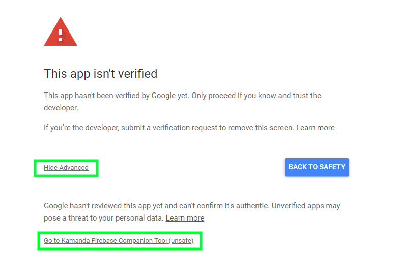

# Kamanda - Firebase Console in your Terminal

[](https://www.npmjs.com/package/kamanda)
[](https://github.com/mainawycliffe/kamanda/releases/latest)
[](https://github.com/mainawycliffe/kamanda/actions?query=workflow%3A%22Go+Tests%22)
[](https://github.com/mainawycliffe/kamanda/actions?query=workflow%3A%22Go+Linting%22)
[](https://github.com/mainawycliffe/kamanda/actions?query=workflow%3A%22Go+Release%22)

> Use `kamanda users` instead of `kamanda auth`, which is being removed after being deprecated in the previous version (v0.8.0).

Kamanda helps manage your Firebase Project from the terminal. It helps you manage
user data in Firebase Authentication. You can add, remove, update, list and search
Firebase users from your console. Functionalities for Cloud Firestore and Cloud
Functions are on the pipeline.

> This is not meant to replace Firebase CLI but to compliment it.

## Table of Content <!-- omit in toc -->

- [Why?](#why)
- [Installation](#installation)
  - [Using npm (Node Package Manager)](#using-npm-node-package-manager)
  - [Executable Binaries](#executable-binaries)
- [Usage](#usage)
  - [Documentation](#documentation)
  - [CI Environment](#ci-environment)
  - [Multiple Project Support](#multiple-project-support)
- [Features](#features)
- [Work in Progress](#work-in-progress)
- [Contributors](#contributors)
- [Roadmap](#roadmap)

## Why?

Kamanda is meant to make your work as developer easier by providing with well
built tools to help you manage your Firebase project quickly.

For instance you want to create a new admin user for your Firebase App, you can
use Kamanda to quickly add the user and attach the necessary custom claims. You
can also attach or remove a users custom claims, view list of users among other
functionality currently available for Firebase Auth.

In future as Kamanda gains support for Firestore, it will give you can easy way
to explore, export, import and manipulate your Firestore documents, right from
the cloud without writing extra code.

## Installation

Follow the installation instruction [here](https://kamanda.dev/installation/).

> This is still an early version, feedback on improvements is much needed.

## Usage

There are a few things to keep in minds, Kamanda works inside a Firebase Project
and not outside and is meant to provide extra functionality and not replace
Firebase CLI.

First you will need to login just like Firebase CLI, this provides Kamanda with
the credentials it requires in order to perform most of the tasks.

You can login by running the following command:

```sh
kamanda login
```

> Kamanda mimics Firebase in this regard, so all authentication commands work
similar to Firebase CLI Authentication commands.

Login to your Google Account and Give Kamanda the permission it requires. As of
now, you might get a warning from Google, I am working to have the app verified
as soon as possible.



> Kamanda is a fully open source project, no information is corrected at any time.

### Documentation

Documentation for this project can be found [here](https://kamanda.dev).

### CI Environment

If you are in CI environment, you can use the `--token` flag to pass the
firebase refresh token without login in. You can acquire the refresh token by
running `kamanda login:ci`.

### Multiple Project Support

Kamanda also support multiple Firebase project within the same workspace just
like `firebase cli`. You can use the `--project` flag to pass either the project
name or project alias you wish to execute the command on. If the flag is not
specified, Kamanda uses the `default` project with the workspace. This is
usually specified inside the `.firebaserc` file at the root of you workspace.
Please note, Kamanda cannot be used to setup multiple projects, this can only be
done using Firebase CLI.

## Features

- Firebase Auth Users:
  - Add Single Users - Ideal for adding a user quickly
  - Edit, Delete a User Account By ID
  - Get a user by UID or Email Address
  - Add Custom Claims to a User Account
  - Add User by Bulk using a JSON/Yaml File
  - List Users

## Work in Progress

Its still a work in progress, I hope to wrap the first few features in
the coming weeks (mid april at the latest).

## Contributors

Contributions are always welcome.

## Roadmap

This is currently our roadmap, please feel free to request additions/changes.

| Feature          | Progress |
| ---------------- | -------- |
| Firebase Auth    | ✔✔       |
| Cloud Firestore  | 🔜        |
| Firebase Storage | 🔜        |
