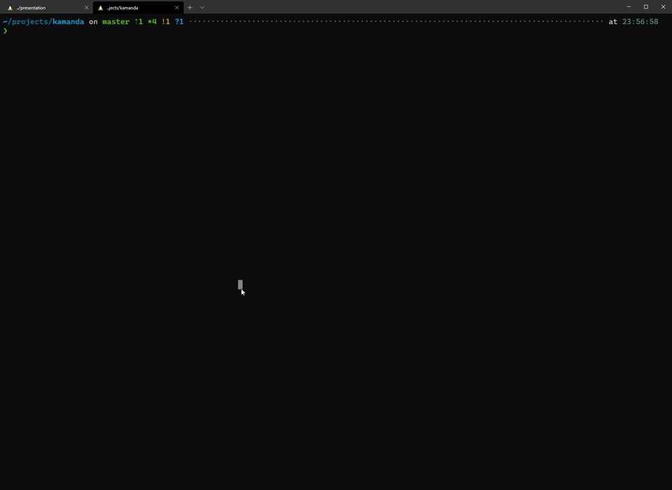
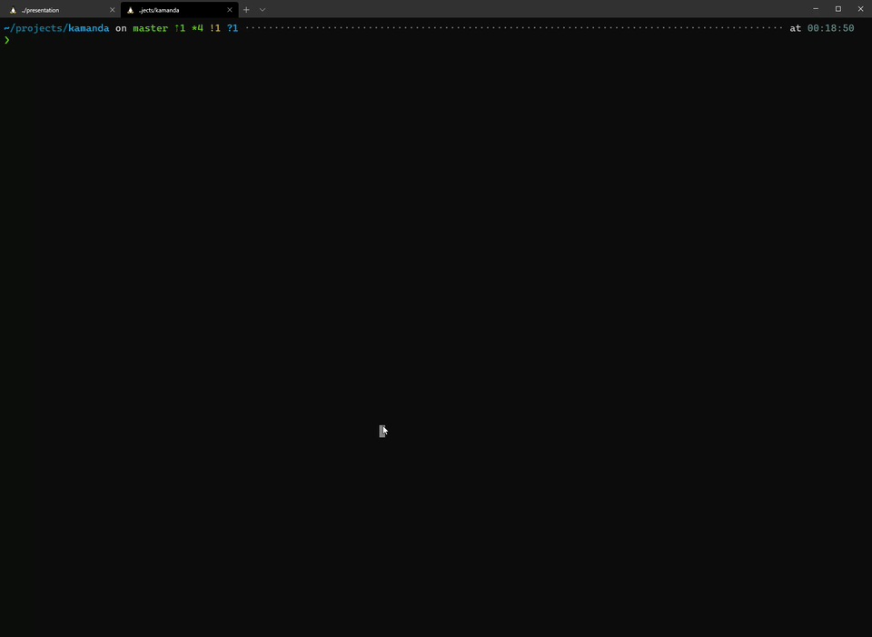

# Kamanda - A Firebase CLI Companion Tool

This tool is meant to provide additional functionality not provided by Firebase
CLI such as Managing Users of your Projects, Exporting and Importing of Cloud
Firestore Data.

> This is not meant to replace Firebase CLI but to compliment it.

## Installation

> This is still an early version, feedback on improvements is much needed.

### Using npm (Node Package Manager)

You can use npm to install Kamanda:

```sh
npm -g install kamanda
```

> NB: At the moment, it doesn't work with yarn, I am working on a solution for this.

### Executable Binaries

You can find the latest binaries for your operating system in the [releases](https://github.com/mainawycliffe/kamanda/releases).

## Features

- Firebase Auth Users:
  - Add Single Users - Ideal for adding a user quickly
  - Edit, Delete a User Account By ID
  - Get a user by UID or Email Address
  - Add Custom Claims to a User Account
  - Add User by Bulk using a JSON/Yaml File
  - List Users

Documentation will come soon.

An example of viewing and adding users:



A demo for adding custom claims:



## Work in Progress

Its still a work in progress, I hope to wrap the first few features in
the coming weeks (mid april at the latest).

## Contributors

Contributions are always welcome.

## Roadmap

This is currently our roadmap, please feel free to request additions/changes.

| Feature          | Progress |
| ---------------- | -------- |
| Firebase Auth    | ✔✔       |
| Cloud Firestore  | 🔜        |
| Firebase Storage | 🔜        |
